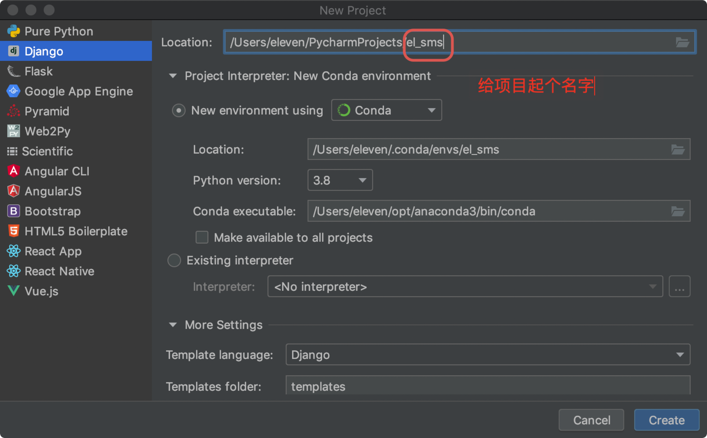
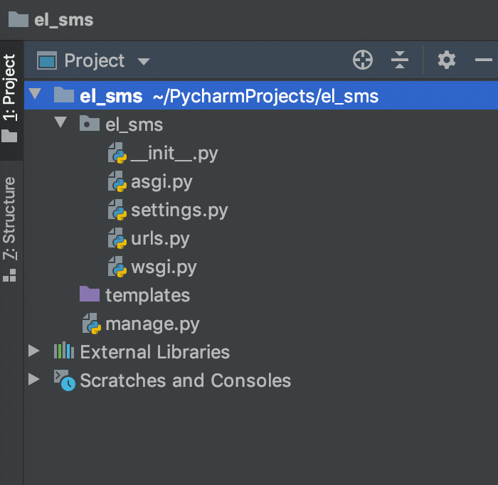
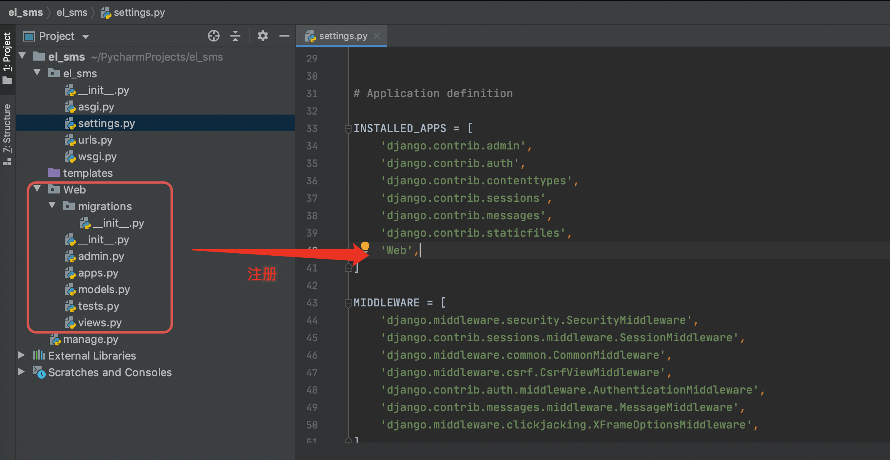
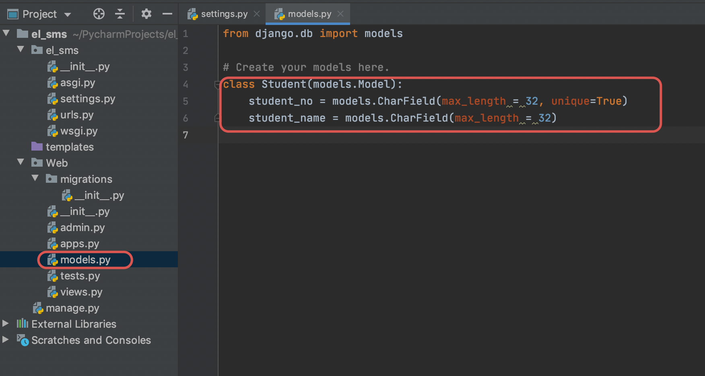
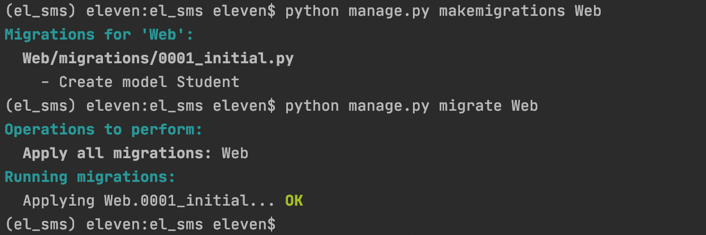
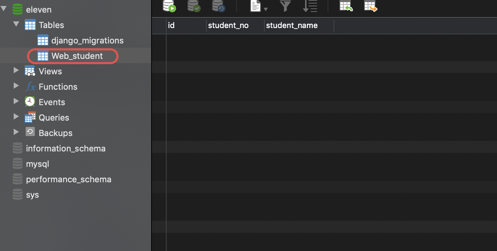
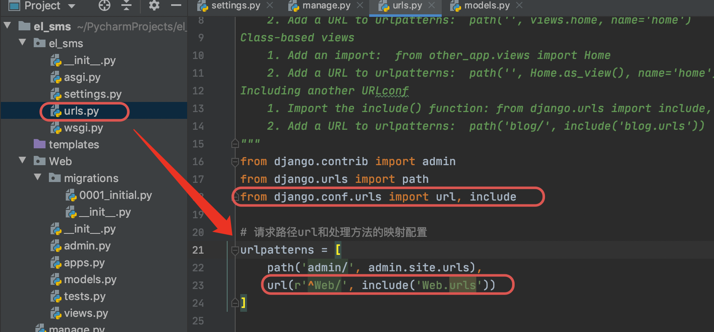
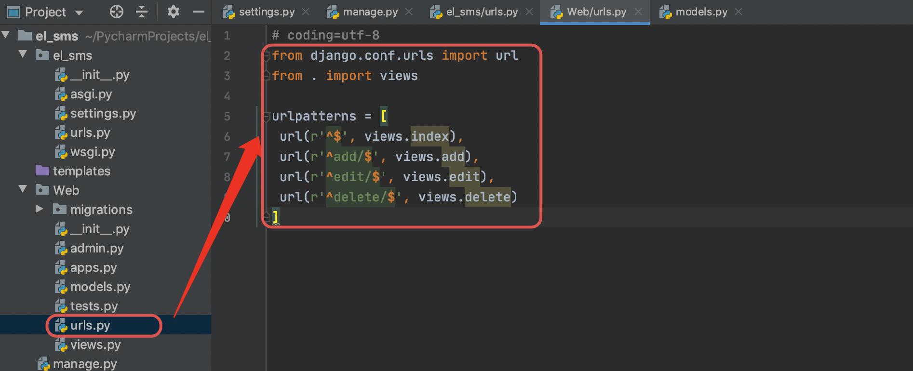
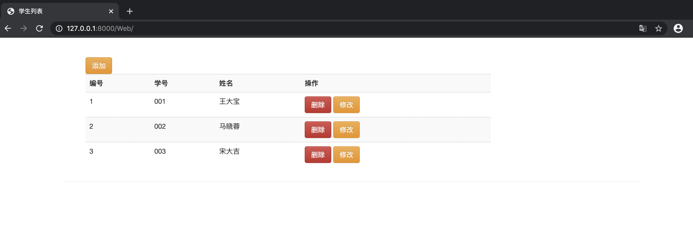

### 1.开发环境

开发工具：`Pycharm 2020.1.1`

开发语言：`Python 3.8.5`

Web框架：`Djanjo 3.0.3`

前端框架：`bootstrap 3.3.7`

数据库：`MySQL 8.0.21 + Navicat Premium 15.0.17`

操作系统：`macOS 10.14.6`

### 2.项目实战

#### 1）创建`Django`项目

- `Pycharm`创建`Django`



- 目录结构如下



#### 2）创建应用

- 打开`Pycharm`的终端，输入如下命令，创建`Web应用`

```python
python manage.py startapp Web    # Web名字可以任意取
```


- 在`settings.py`文件里`INSTALLED_APPS`下面添加`Web`完成应用注册



#### 3）配置MySQL

- 修改`settings.py`文件中的`sqlite3`为`MySQL`


```python
DATABASES = {
    'default': {
        'ENGINE': 'django.db.backends.mysql',
        'NAME': 'eleven',
        'USER': 'root',
        'PASSWORD': '123456',
        'HOST': '127.0.0.1',
        'PORT': 3306
    }
}
```

#### 4）数据模型层创建

- 在应用`Web`下的`models.py`添加`Student模型`



```python
class Student(models.Model):
    student_no = models.CharField(max_length = 32, unique=True)
    student_name = models.CharField(max_length = 32)
```

- 执行如下命令，在数据库生成表结构

```python
# 生成文件记录模型的变化
python manage.py makemigrations Web
# 将模型变化同步至数据库，我们可以在数据库生成对应的表结构
python manage.py migrate Web
```



- 数据库中生成的表



#### 5）路由配置

- 在`el_sms`里面的`urls.py`里面添加`Web的路由配置`



```python
from django.contrib import admin
from django.urls import path
from django.conf.urls import url, include

# 请求路径url和处理方法的映射配置
urlpatterns = [
    path('admin/', admin.site.urls),
    url(r'^Web/', include('Web.urls'))
]
```

- 然后在`Web`创建一个`urls.py`文件，添加路由配置如下：

```python
# coding=utf-8
from django.conf.urls import url
from . import views

urlpatterns = [
 url(r'^$', views.index),
 url(r'^add/$', views.add),
 url(r'^edit/$', views.edit),
 url(r'^delete/$', views.delete)
]
```



#### 6）增删改查视图函数

- 在应用Web的视图层文件`views.py`添加对`学生信息增删改查`的处理函数

```python
import MySQLdb
from django.shortcuts import render, redirect

# Create your views here.

# 连接MySQL数据库
conn = MySQLdb.connect(host="localhost", user="root", passwd="123456", db="eleven", charset='utf8')


# 学生信息列表处理函数
def index(request):
    with conn.cursor(cursorclass=MySQLdb.cursors.DictCursor) as cursor:
        cursor.execute("SELECT id,student_no,student_name FROM Web_student")
    students = cursor.fetchall()
    return render(request, 'student/index.html', {'students': students})


# 学生信息新增处理函数
def add(request):
    if request.method == 'GET':
        return render(request, 'student/add.html')
    else:
        student_no = request.POST.get('student_no', '')
    student_name = request.POST.get('student_name', '')
    with conn.cursor(cursorclass=MySQLdb.cursors.DictCursor) as cursor:
        cursor.execute("INSERT INTO Web_student (student_no,student_name) "
                       "values (%s,%s)", [student_no, student_name])
        conn.commit()
    return redirect('../')


# 学生信息修改处理函数
def edit(request):
    if request.method == 'GET':
        id = request.GET.get("id")
        with conn.cursor(cursorclass=MySQLdb.cursors.DictCursor) as cursor:
            cursor.execute("SELECT id,student_no,student_name FROM Web_student where id =%s", [id])
            student = cursor.fetchone()
        return render(request, 'student/edit.html', {'student': student})
    else:
        id = request.POST.get("id")
        student_no = request.POST.get('student_no', '')
        student_name = request.POST.get('student_name', '')
        with conn.cursor(cursorclass=MySQLdb.cursors.DictCursor) as cursor:
            cursor.execute("UPDATE Web_student set student_no=%s,student_name=%s where id =%s",
                           [student_no, student_name, id])
            conn.commit()
        return redirect('../')


# 学生信息删除处理函数
def delete(request):
    id = request.GET.get("id")
    with conn.cursor(cursorclass=MySQLdb.cursors.DictCursor) as cursor:
        cursor.execute("DELETE FROM Web_student WHERE id =%s", [id])
    conn.commit()
    return redirect('../')
```


#### 7）模板页面创建


- 学生信息列表页

```python
<!DOCTYPE html>
<html lang="en">
<head>
    <meta charset="UTF-8">
    <title>学生列表</title>
    <!-- 最新版本的 Bootstrap 核心 CSS 文件 -->
    <link rel="stylesheet" href="https://cdn.jsdelivr.net/npm/bootstrap@3.3.7/dist/css/bootstrap.min.css"
          integrity="sha384-BVYiiSIFeK1dGmJRAkycuHAHRg32OmUcww7on3RYdg4Va+PmSTsz/K68vbdEjh4u" crossorigin="anonymous">

    <!-- 可选的 Bootstrap 主题文件（一般不用引入） -->
    <link rel="stylesheet" href="https://cdn.jsdelivr.net/npm/bootstrap@3.3.7/dist/css/bootstrap-theme.min.css"
          integrity="sha384-rHyoN1iRsVXV4nD0JutlnGaslCJuC7uwjduW9SVrLvRYooPp2bWYgmgJQIXwl/Sp" crossorigin="anonymous">

    <!-- 最新的 Bootstrap 核心 JavaScript 文件 -->
    <script src="https://cdn.jsdelivr.net/npm/bootstrap@3.3.7/dist/js/bootstrap.min.js"
            integrity="sha384-Tc5IQib027qvyjSMfHjOMaLkfuWVxZxUPnCJA7l2mCWNIpG9mGCD8wGNIcPD7Txa"
            crossorigin="anonymous"></script>
</head>
<body>
<div class="container page-header">
    <div class="container page-body">

        <div class="col-md-9" role="main">
            <table class="table table-striped">
                <a class="btn btn-warning" href="../Web/add" role="button">添加</a>
                <tr>
                    <th>编号</th>
                    <th>学号</th>
                    <th>姓名</th>
                    <th>操作</th>
                </tr>
                
                    <tr>
                        <td>{{ forloop.counter }}</td>
                        <td>{{ student.student_no }}</td>
                        <td>{{ student.student_name }}</td>
                        <td>
                            <a class="btn btn-danger" href="../Web/delete?id={{ student.id }}">删除</a>
                            <a class="btn btn-warning" href="../Web/edit?id={{ student.id }}">修改</a>
                        </td>
                    </tr>
                     
            </table>
        </div>
    </div>
</div>

</body>
</html>
```

- 学生信息新增页

```python
<!DOCTYPE html>
<html lang="en">
<head>
    <meta charset="UTF-8">
    <title>学生添加</title>
   <!-- ⌘⌥L 格式化代码 -->
    <!-- 最新版本的 Bootstrap 核心 CSS 文件 -->
    <link rel="stylesheet" href="https://cdn.jsdelivr.net/npm/bootstrap@3.3.7/dist/css/bootstrap.min.css"
          integrity="sha384-BVYiiSIFeK1dGmJRAkycuHAHRg32OmUcww7on3RYdg4Va+PmSTsz/K68vbdEjh4u" crossorigin="anonymous">

    <!-- 可选的 Bootstrap 主题文件（一般不用引入） -->
    <link rel="stylesheet" href="https://cdn.jsdelivr.net/npm/bootstrap@3.3.7/dist/css/bootstrap-theme.min.css"
          integrity="sha384-rHyoN1iRsVXV4nD0JutlnGaslCJuC7uwjduW9SVrLvRYooPp2bWYgmgJQIXwl/Sp" crossorigin="anonymous">

    <!-- 最新的 Bootstrap 核心 JavaScript 文件 -->
    <script src="https://cdn.jsdelivr.net/npm/bootstrap@3.3.7/dist/js/bootstrap.min.js"
            integrity="sha384-Tc5IQib027qvyjSMfHjOMaLkfuWVxZxUPnCJA7l2mCWNIpG9mGCD8wGNIcPD7Txa"
            crossorigin="anonymous"></script>
</head>
<body>
<div class="container page-header">
    <div class="container page-body">
        <form class="form-horizontal" method="post" action="../add/">
            
            <div class="form-group">
                <label for="inputEmail3" class="col-sm-2 control-label">学号</label>
                <div class="col-sm-3">
                    <input type="text" class="form-control" placeholder="请输入学号" name="student_no"/>
                </div>
            </div>
            <div class="form-group">
                <label for="inputEmail3" class="col-sm-2 control-label">姓名</label>
                <div class="col-sm-3">
                    <input type="text" class="form-control" placeholder="请输入姓名" name="student_name"/>
                </div>
            </div>
            <div class="form-group">
                <div class="col-sm-offset-2 col-sm-10">
                    <button type="submit" class="btn btn-default">Sign in</button>
                </div>
            </div>
        </form>
    </div>
</div>

</body>
</html>
```

- 学生信息编辑页

```python
<!DOCTYPE html>
<html lang="en">
<head>
    <meta charset="UTF-8">
    <title>学生修改</title>
    <!-- 最新版本的 Bootstrap 核心 CSS 文件 -->
    <link rel="stylesheet" href="https://cdn.jsdelivr.net/npm/bootstrap@3.3.7/dist/css/bootstrap.min.css"
          integrity="sha384-BVYiiSIFeK1dGmJRAkycuHAHRg32OmUcww7on3RYdg4Va+PmSTsz/K68vbdEjh4u" crossorigin="anonymous">

    <!-- 可选的 Bootstrap 主题文件（一般不用引入） -->
    <link rel="stylesheet" href="https://cdn.jsdelivr.net/npm/bootstrap@3.3.7/dist/css/bootstrap-theme.min.css"
          integrity="sha384-rHyoN1iRsVXV4nD0JutlnGaslCJuC7uwjduW9SVrLvRYooPp2bWYgmgJQIXwl/Sp" crossorigin="anonymous">

    <!-- 最新的 Bootstrap 核心 JavaScript 文件 -->
    <script src="https://cdn.jsdelivr.net/npm/bootstrap@3.3.7/dist/js/bootstrap.min.js"
            integrity="sha384-Tc5IQib027qvyjSMfHjOMaLkfuWVxZxUPnCJA7l2mCWNIpG9mGCD8wGNIcPD7Txa"
            crossorigin="anonymous"></script>
</head>
<body>
<div class="container page-header">
    <div class="container page-body">
        <form class="form-horizontal" method="post" action="../edit/">
            
            <input type="hidden" name="id" value="{{ student.id }}"/>
            <div class="form-group">
                <label for="inputEmail3" class="col-sm-2 control-label">学号</label>
                <div class="col-sm-3">
                    <input type="text" class="form-control" placeholder="Text input" name="student_no"
                           value="{{ student.student_no }}"/>
                </div>
            </div>

            <div class="form-group">
                <label for="inputEmail3" class="col-sm-2 control-label">姓名</label>
                <div class="col-sm-3">
                    <input type="text" class="form-control" placeholder="Text input" name="student_name"
                           value="{{ student.student_name }}"/>
                </div>
            </div>

            <div class="form-group">
                <div class="col-sm-offset-2 col-sm-10">
                    <button type="submit" class="btn btn-default">修改</button>
                </div>
            </div>

        </form>
    </div>
</div>
</body>
</html>
```


#### 8）启动web服务

- Terminal终端输入以下命令启动web服务

```python
python manage.py runserver
```

#### 9）功能演示

- 服务启动后,打开浏览器输入`http://127.0.0.1:8000/Web`即可进入学生信息管理列表页




