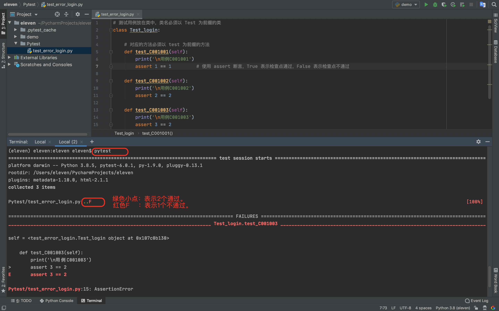
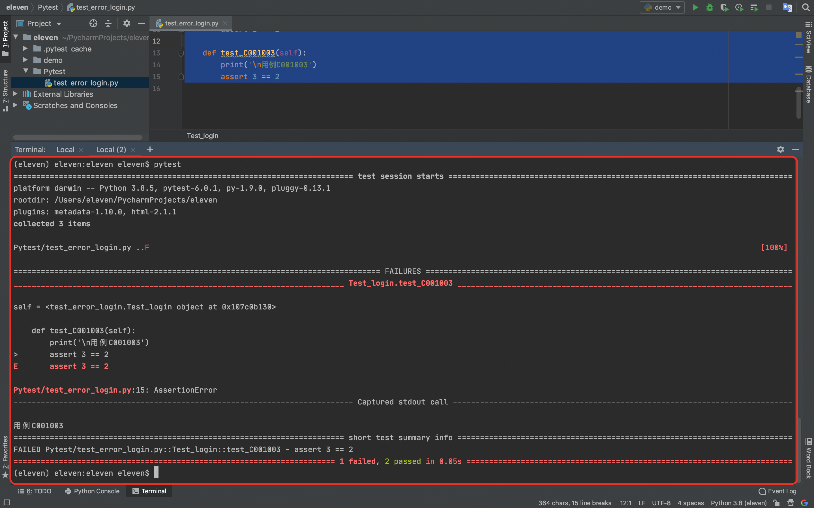
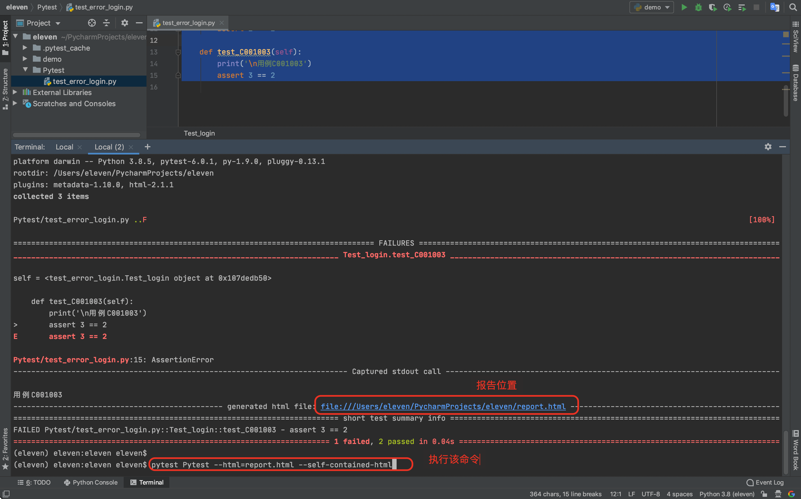
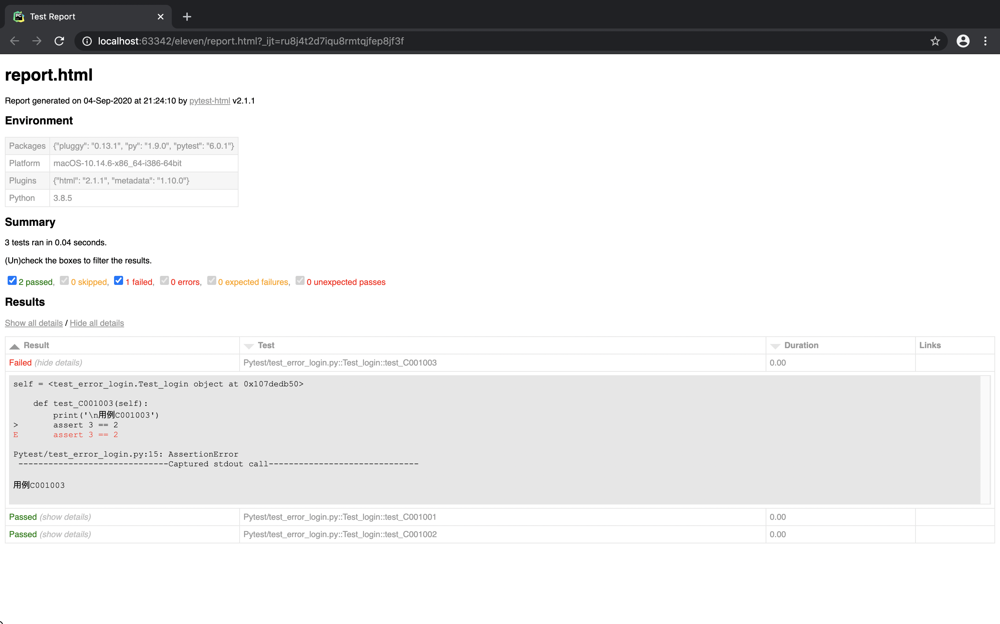

### 1.特点  
```python
    1)unittest、pytest-->白盒单元测试，系统测试。
    2)robotframwwork-->系统测试。
    3)初始化清楚机制、灵活挑选测试用例。
    4)利用第三方插件，生成不错的报表。
```


### 2.安装
​	1)安装pytest
​	    

```python
pip install pytest
```

​	2)安装第三方插件
​	    

```python
pip install pytest-html
```

### 3.如何让 pytest 知道哪些是自动化的测试用例呢？
```python
	1)未指定命令行参数，从当前目录开始收集。
	2)命令行参数指定了 目录、文件名、，则按参数来找。
	3)会搜索名称为 test_*.py 或 *_test.py 文件。
	4) test 为前缀的函数 || Test 为前缀的类里面的 test 为前缀的方法
```


### 4.测试用例代码

​	1)必须以 `test_` 开头，或者以 `_test` 结尾

如创建一个文件名为 `test_error_login.py`。

其中 `autotest` 是我们创建自动化下面的根目录

代码如下：

```python
# 测试用例放在类中，类名必须以 Test 为前缀的类
class Test_login:

    # 对应的方法必须以 test 为前缀的方法
    def test_C001001(self):
        print('\n用例C001001')
        assert 1 == 1         # 使用 assert 断言，True 表示检查点通过，False 表示检查点不通过

    def test_C001002(self):
        print('\n用例C001002')
        assert 2 == 2

    def test_C001003(self):
        print('\n用例C001003')
        assert 3 == 2
```





### 5.命令

```python
pytest -s     # 显示print的内容
pytest -sv    # 得到更详细的执行信息
pytest cases  # 指定一个目录存放测试用例，避免程序到其它目录找其它测试用例。
```

### 6.产生报告

`pytest-html`这个插件就是用来产生测试报告的。

需要在命令行加上参数 

```python
pytest cases --html=report.html --self-contained-html
```



报告界面如下：



如生成的中文有乱码：

1）打开该插件对应的代码文件，通常在解释器目录下：`site-packages\pytest_html\plugin.py`

找到如下代码：

```python
class TestResult:
    def __init__(self, outcome, report, logfile, config):
          self.test_id = report.nodeid.encode("utf-8").decode("unicode_escape")
```

修改为：

```python
class TestResult:
    def __init__(self, outcome, report, logfile, config):
          # 解决乱码问题
          # self.test_id = report.nodeid.encode("utf-8").decode("unicode_escape")
          self.test_id = report.nodeid
```

