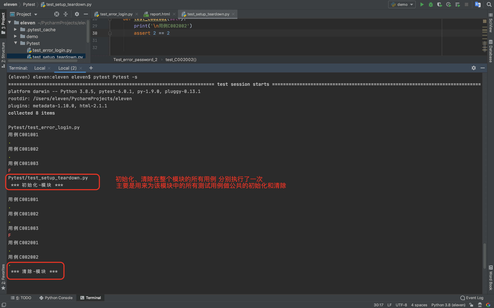
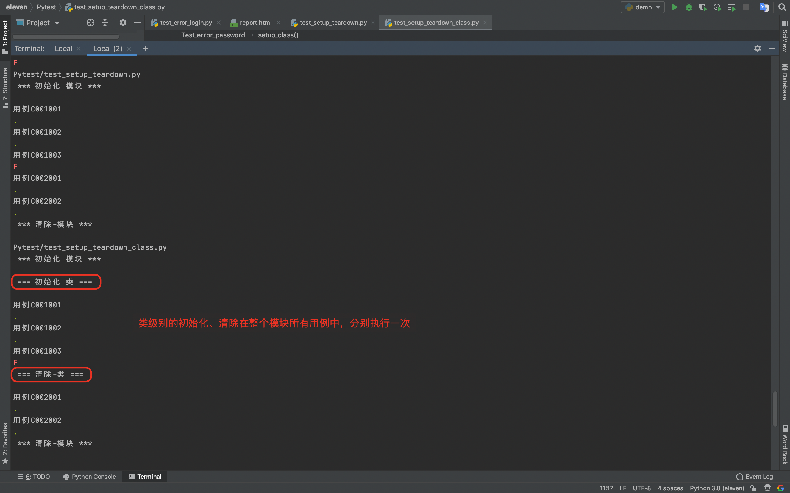
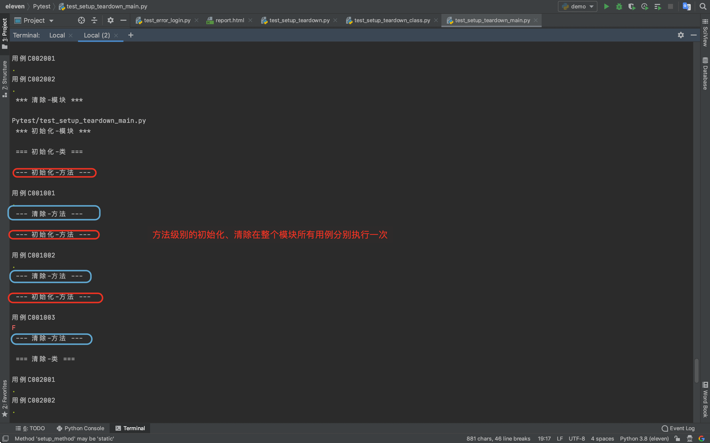

### 1.模块级别

`模块级别` 的初始化、清除 分别在`整个模块`的测试用例执行 初始化前 清除后 执行，`并且只会执行1次`。

定义 `setup_module` 和 `teardown_module` 全局函数

创建一个名为`test_setup_teardown.py`的文件，里面内容如下：

```python
def setup_module():
    print('\n *** 初始化-模块 ***')

def teardown_module():
    print('\n *** 清除-模块 ***')

''' 错误密码 '''
class Test_error_password:

    def test_C001001(self):
        print('\n用例C001001')
        assert 1 == 1

    def test_C001002(self):
        print('\n用例C001002')
        assert 2 == 2

    def test_C001003(self):
        print('\n用例C001003')
        assert 3 == 2

class Test_error_password_2:

    def test_C002001(self):
        print('\n用例C002001')
        assert 1 == 1

    def test_C002002(self):
        print('\n用例C002002')
        assert 2 == 2

```



### 2.类级别

`类级别`的初始化、清除 分别在`整个类`的测试用例执行 初始化前 清除后 执行，`并且只会执行1次`。

创建一个名为`test_setup_teardown_class.py`的文件，里面内容如下：

```python
def setup_module():
    print('\n *** 初始化-模块 ***')

def teardown_module():
    print('\n *** 清除-模块 ***')

""" 错误密码 """
class Test_error_password:

    """ 类级别 """
    @classmethod
    def setup_class(cls):
        print('\n === 初始化-类 ===')

    @classmethod
    def teardown_class(cls):
        print('\n === 清除-类 ===')

    def test_C001001(self):
        print('\n用例C001001')
        assert 1 == 1

    def test_C001002(self):
        print('\n用例C001002')
        assert 2 == 2

    def test_C001003(self):
        print('\n用例C001003')
        assert 3 == 2

class Test_error_password_2:

    def test_C002001(self):
        print('\n用例C002001')
        assert 1 == 1

    def test_C002002(self):
        print('\n用例C002002')
        assert 2 == 2
```




### 3.方法级别

`方法级别`的初始化、清除 分别在整个`测试方法`的测试用例执行 初始化前 清除后 执行，`并且每个用例分别执行1次`。

创建一个名为`test_setup_teardown_method.py`的文件，里面内容如下：

```python
def setup_module():
    print('\n *** 初始化-模块 ***')

def teardown_module():
    print('\n *** 清除-模块 ***')

""" 错误密码 """
class Test_error_password:

    """ 类级别 """
    @classmethod
    def setup_class(cls):
        print('\n === 初始化-类 ===')

    @classmethod
    def teardown_class(cls):
        print('\n === 清除-类 ===')

    def setup_method(self):
        print('\n --- 初始化-方法 ---')

    def teardown_method(self):
        print('\n --- 清除-方法 ---')

    def test_C001001(self):
        print('\n用例C001001')
        assert 1 == 1

    def test_C001002(self):
        print('\n用例C001002')
        assert 2 == 2

    def test_C001003(self):
        print('\n用例C001003')
        assert 3 == 2

class Test_error_password_2:

    def test_C002001(self):
        print('\n用例C002001')
        assert 1 == 1

    def test_C002002(self):
        print('\n用例C002002')
        assert 2 == 2

```



### 4.目录级别

`目标级别` 的初始化清除，就是针对`整个目录`执行的初始化、清除。

创建一个名为`conftest.py`的文件，里面内容如下：

```python
import pytest

@pytest.fixture(scope='package', autouse=True)
def st_emptyEnv():
    print(f'\n### 初始化-目录A')
    yield

    print(f'\n### 清除-目录A')
```

我们可以在多个目录下面放置这样的文件，定义该目录的初始化清除。`pytest` 在执行测试时，会层层调用。

```python
(eleven) eleven:eleven eleven$ pytest Pytest -s
=========================================================================== test session starts ============================================================================
platform darwin -- Python 3.8.5, pytest-6.0.1, py-1.9.0, pluggy-0.13.1
rootdir: /Users/eleven/PycharmProjects/eleven
plugins: metadata-1.10.0, html-2.1.1
collected 18 items                                                                                                                                                         

Pytest/test_error_login.py 
### 初始化-目录A

用例C001001
.
用例C001002
.
用例C001003
F
Pytest/test_setup_teardown.py 
 *** 初始化-模块 ***

用例C001001
.
用例C001002
.
用例C001003
F
用例C002001
.
用例C002002
.
 *** 清除-模块 ***

Pytest/test_setup_teardown_class.py 
 *** 初始化-模块 ***

 === 初始化-类 ===

用例C001001
.
用例C001002
.
用例C001003
F
 === 清除-类 ===

用例C002001
.
用例C002002
.
 *** 清除-模块 ***

Pytest/test_setup_teardown_main.py 
 *** 初始化-模块 ***

 === 初始化-类 ===

 --- 初始化-方法 ---

用例C001001
.
 --- 清除-方法 ---

 --- 初始化-方法 ---

用例C001002
.
 --- 清除-方法 ---

 --- 初始化-方法 ---

用例C001003
F
 --- 清除-方法 ---

 === 清除-类 ===

用例C002001
.
用例C002002
.
 *** 清除-模块 ***

### 清除-目录A
```

