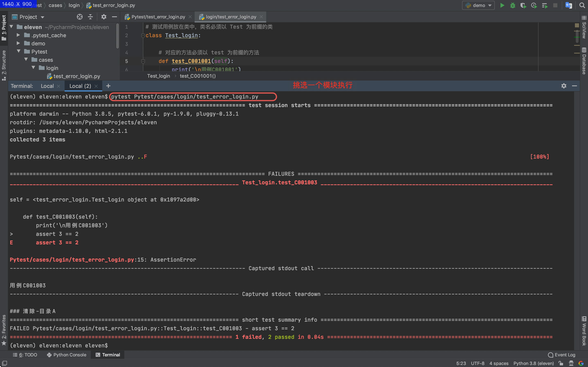
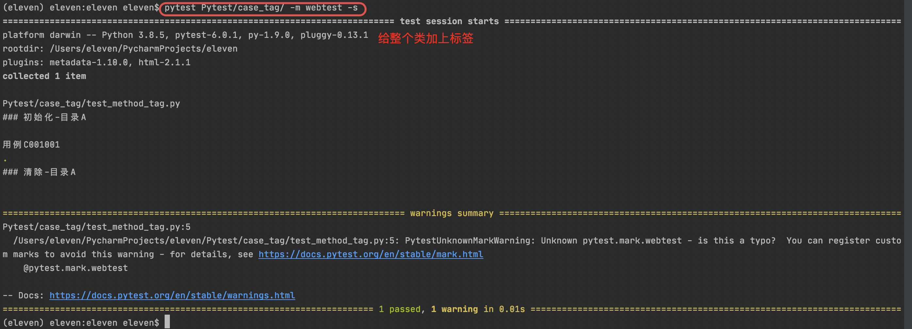

### 1.指定一个模块

只挑选一个模块执行

```python
pytest Pytest/cases/login/test_error_login.py
```

```python
# 测试用例放在类中，类名必须以 Test 为前缀的类
class Test_login:

    # 对应的方法必须以 test 为前缀的方法
    def test_C001001(self):
        print('\n用例C001001')
        assert 1 == 1         # 使用 assert 断言，True 表示检查点通过，False 表示检查点不通过

    def test_C001002(self):
        print('\n用例C001002')
        assert 2 == 2

    def test_C001003(self):
        print('\n用例C001003')
        assert 3 == 2
```



### 2.指定目录

只挑选一个目录执行

```python
pytest Pytest\cases    # cases指的是文件夹
```

也可以指定多个目录

```python
pytest Pytest/case1 Pytest/case2    # 同时执行cases1和cases2目录下面的文件
```


### 3.指定模块里面的函数或者类

指定一个类

```python
pytest Pytest/case1/login/test_error_login.py::Test_error_password
```

指定类里面的方法

```python
 pytest Pytest/case1/login/test_error_login.py::Test_error_password::test_C001001
```

`test_error_login.py`文件如下：

```python
def setup_module():
    print('\n *** 初始化-模块 ***')

def teardown_module():
    print('\n *** 清除-模块 ***')

""" 错误密码 """
class Test_error_password:

    """ 类级别 """
    @classmethod
    def setup_class(cls):
        print('\n === 初始化-类 ===')

    @classmethod
    def teardown_class(cls):
        print('\n === 清除-类 ===')

    def setup_method(self):
        print('\n --- 初始化-方法 ---')

    def teardown_method(self):
        print('\n --- 清除-方法 ---')

    def test_C001001(self):
        print('\n用例C001001')
        assert 1 == 1

    def test_C001002(self):
        print('\n用例C001002')
        assert 2 == 2

    def test_C001003(self):
        print('\n用例C001003')
        assert 3 == 2

class Test_error_password_2:

    def test_C002001(self):
        print('\n用例C002001')
        assert 1 == 1

    def test_C002002(self):
        print('\n用例C002002')
        assert 2 == 2

```


### 4.根据名字

可以使用命令行参数 `-k` 后面加名字来挑选要执行的测试项

```python
pytest -k C001001 -s
""" 
1）-k 后面的名字，可以是测试函数的名字，可以是类的名字，可以是模块文件的名字，可以是目录的名字
2）是大小写敏感的
3）不一定要完整，只要能有部分匹配上就行
"""
```

可以用 `not` 表示选择名字中不包含`C001001`，比如

```python
pytest -k "not C001001" -s
```

可以用 `add` 表示选择名字同时包含多个关键字，比如

```python
pytest -k "error and password" -s
```

可以用 `or` 表示选择名字包含指定关键字之一即可，比如

```python
pytest -k "error or password" -s
```

### 5.根据标签

可以给某个方法加上标签 `webtest`

```python
import pytest

class Test_error_password:

    @pytest.mark.webtest
    def test_C001001(self):
        print('\n用例C001001')
        assert 1 == 1
```

然后，可以这样运行指定标签的用例

```python
pytest Pytest/case_tag/ -m webtest -s
```

也可以这样给整个类加上标签

```python
@pytest.mark.webtest
class Test_错误密码2:

    def test_C001021(self):
        print('\n用例C001021')
        assert 1 == 1
```



运行方法也是一样

```python
pytest Pytest/case_tag/ -m webtest -s
```

可以同时添加多个标签

```python
import pytest

class Test_error_password:

    @pytest.mark.webtest
    @pytest.mark.waptest
    def test_C001001(self):
        print('\n用例C001001')
        assert 1 == 1
```

第一种标签法：可以这样定义一个全局变量 `pytestmark` 为整个模块文件 设定标签

```python
import pytest
pytestmark = pytest.mark.webtest
```

如果需要定义多个标签，可以定义一个列表

```python
import pytest
pytestmark = [pytest.mark.webtest, pytest.mark.waptest]
```

第二种标签法（简单）：在目录下新建`pytest.ini`,前面是你标签名称，后面是对标签的注释（注释可以不写）

```python
[pytest]
markers =
    webtest:webtest
    waptest:waptest
```

执行：

```python
pytest -m waptest
```

