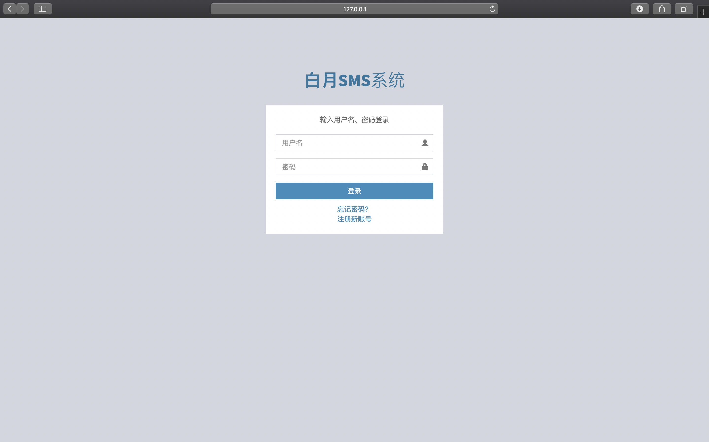
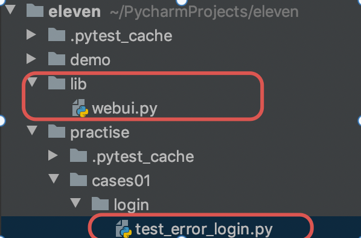
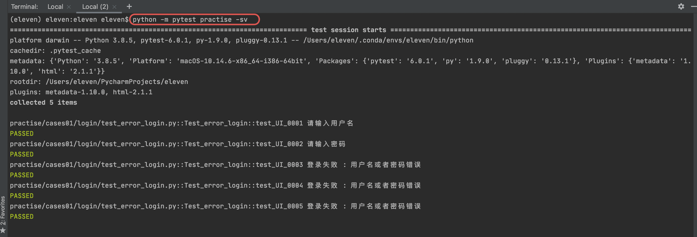

### 1.下载白月SMS系统

`mac、windows：`

```html
https://pan.baidu.com/s/1rnWhuroIMNebStzpwLjsTA#list/path=%2F
```

测试用例：

```html
https://github.com/jcyrss/baiyueheiyu/files/3986495/tcs-selenium.xlsx
```

### 2.启动白月SMS系统

`mac`：

```python
执行 pip3 install django 安装Django
执行 ./runserver.sh 启动服务
由于需要80端口权限，是sudo方式启动，需要输入当前用户密码
```

`windows`：

```html
下载解压bysms.zip后，进入bysms目录，双击运行runserver.bat 即可启动 白月SMS系统。
```

浏览器输入命令，访问`白月SMS系统`：

```html
http://127.0.0.1/mgr/sign.html
```



### 3.实战

使用 `pytest`，完成用例 `UI-0001` 到 `UI-0005` 的自动化

目录结构



`lib/webui.py`

```python
from selenium import webdriver
import time

def loginAndCheck(username, password):
    driver = webdriver.Chrome()    # 加载谷歌浏览器驱动
    driver.implicitly_wait(10)     # 隐式等待10秒

    driver.get('http://127.0.0.1/mgr/sign.html')    # 需要先启动白月SMS系统

    if username is not None:
        driver.find_element_by_id('username').send_keys(username)    # 用户名

    if password is not None:
        driver.find_element_by_id('password').send_keys(password)    # 密码

    driver.find_element_by_css_selector("button[type='submit']").click()    # 点击登录按钮

    time.sleep(2)    # 睡眠2秒

    alertText = driver.switch_to.alert.text
    print(alertText)

    driver.quit()    # 关闭浏览器

    return alertText

```

`test_error_login.py`

```python
import pytest
from lib.webui import loginAndCheck

class Test_error_login:

    def test_UI_0001(self):
        alertText = loginAndCheck(None, '88888888')    # 不输入用户名，只输入密码
        assert alertText == '请输入用户名'

    def test_UI_0002(self):
        alertText = loginAndCheck('byhy', None)    # 输入用户名，不输入密码
        assert alertText == '请输入密码'

    def test_UI_0003(self):
        alertText = loginAndCheck('byhy', '666666')    # 输入用户名和密码
        assert  alertText == '登录失败 : 用户名或者密码错误'

    def test_UI_0004(self):
        alertText = loginAndCheck('byhh', '88888888')    # 输入错误的用户名，正确的密码
        assert alertText == '登录失败 : 用户名或者密码错误'

    def test_UI_0005(self):
        alertText = loginAndCheck('byhy', '8888888899')    # 输入错误的用户名，错误的密码
        assert alertText == '登录失败 : 用户名或者密码错误'
```

执行命令：

```python
python -m pytest practise -sv
```

