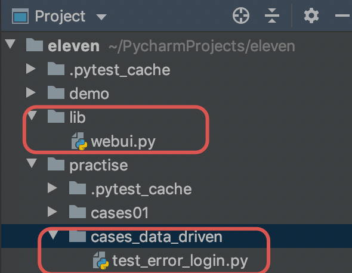
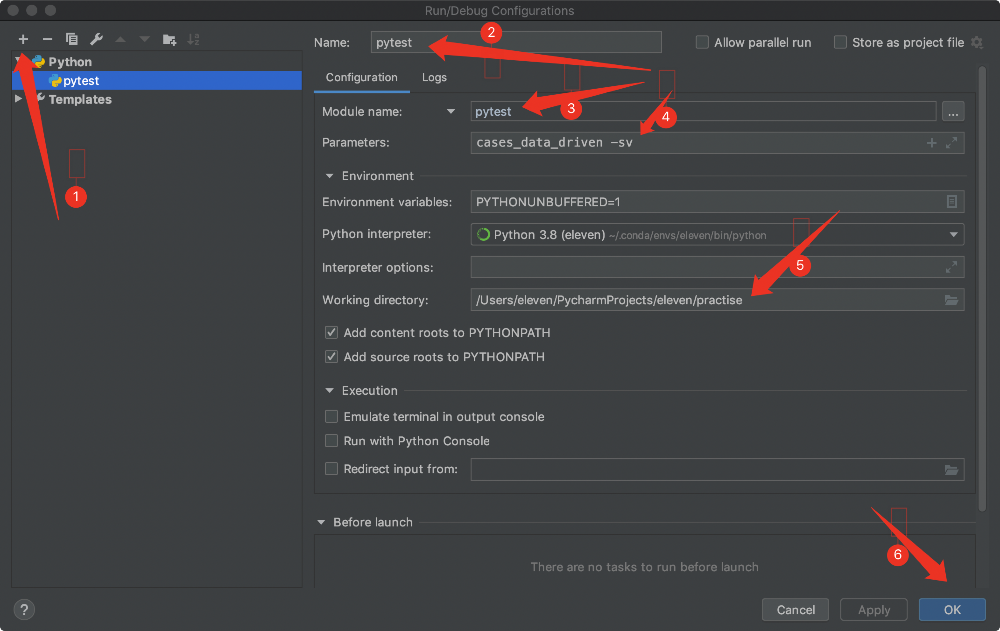

### 1.数据驱动

用例 `UI-0001` 到 `UI-0005` 这5个登录的测试用例，共同的特点是，它们测试步骤是一模一样的，只是输入的数据（用户名、密码）不同，要检查的输出数据（错误提示）不同。

这批测试用例，就是典型的 可以用 `数据驱动` 方式进行自动化的用例。

如果有一批测试用例，具有 `相同的测试步骤` ，只是 `测试参数数据不同` 。

自动化测试时，把测试数据从用例代码中 `分离` 开来，以后增加新的测试用例，只需要修改数据。

这就是数据驱动。

这种情况可以使用 `pytest` 用例 的 数据驱动格式，只需如下定义即可

目录结构：



`lib/webui.py`

```python
from selenium import webdriver
import time

def loginAndCheck(username, password):
    driver = webdriver.Chrome()    # 加载谷歌浏览器驱动
    driver.implicitly_wait(10)     # 隐式等待10秒

    driver.get('http://127.0.0.1/mgr/sign.html')    # 需要先启动白月SMS系统

    if username is not None:
        driver.find_element_by_id('username').send_keys(username)    # 用户名

    if password is not None:
        driver.find_element_by_id('password').send_keys(password)    # 密码

    driver.find_element_by_css_selector("button[type='submit']").click()    # 点击登录按钮

    time.sleep(2)    # 睡眠2秒

    alertText = driver.switch_to.alert.text
    print(alertText)

    driver.quit()    # 关闭浏览器

    return alertText
```

`practise/cases_data_driven/test_error_login`.py

```python
import pytest
from lib.webui import loginAndCheck


class Test_error_login:
    @pytest.mark.parametrize('username, password, expectedalert',[
        (None, '88888888','请输入用户名'),
        ('byhy', None, '请输入密码'),
        ('byh', '88888888', '登录失败：用户名或者密码错误'),
        ('byhy', '888', '登录失败：用户名或者密码错误'),
        ('byhy', '88888888888', '登录失败：用户名或者密码错误')
    ])

    def test_UI_0001_0005(self, username, password, expectedalert):
        alertText = loginAndCheck(username, password)
        assert alertText == expectedalert
```

这样，我们就不需要定义那么多的测试用例方法了， 而且测试数据也可以集中存放。

执行结果：


### 2.调试

`Pycharm`添加断点，如下图



1. 点击打开运行配置
2. 点击+号， 添加一个运行配置，在右边的输入框输入配置名，比如 pytest
3. 点击箭头选择 module name，并且输入 `pytest` 作为运行模块名
4. 参数输入相应的命令行参数，比如 `cases -sv`
5. 工作目录选择项目根目录
6. 点击 OK